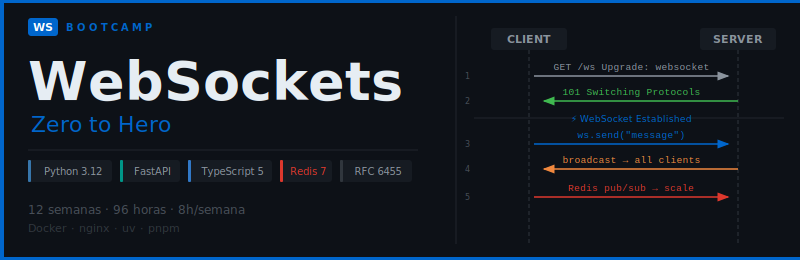

<p align="center">
  
</p>

<p align="center">
  <a href="LICENSE"></a>
  
  
  
  
  
  
</p>

<p align="center">
  <a href="README.md"></a>
</p>

---

## 📋 Description

An intensive **12-week (~3 months)** bootcamp focused on mastering the **WebSocket protocol** and real-time application development. Designed to take students from zero to **real-time application developer (Junior-Mid)**, with emphasis on the RFC 6455 protocol, security best practices, and real-world projects.

### 🎯 Learning Objectives

By the end of the bootcamp, students will be able to:

- ✅ Understand the WebSocket protocol at the wire level (RFC 6455): handshake, frames, opcodes
- ✅ Use the native Browser WebSocket API with TypeScript
- ✅ Build WebSocket servers with pure Python (asyncio + websockets)
- ✅ Build WebSocket endpoints with FastAPI and manage connections
- ✅ Implement messaging patterns: broadcast, unicast, rooms/channels, pub/sub
- ✅ Authenticate and authorize WebSocket connections with JWT
- ✅ Handle state, presence, and real-time synchronization
- ✅ Implement resilience: reconnection, heartbeats, exponential backoff
- ✅ Write automated tests for WebSocket endpoints
- ✅ Apply security best practices (DoS prevention, rate limiting, validation)
- ✅ Scale horizontally with Redis as a message broker
- ✅ Deploy to production with Docker, nginx, and WSS (TLS)

### 🚀 Why WebSockets?

> **WebSockets from protocol to production** — No unnecessary abstractions, just the real technology.

Real-time is no longer a luxury: chats, live dashboards, instant notifications, multiplayer games, and collaborative tools all depend on WebSockets. This bootcamp goes from the fundamentals of the RFC 6455 protocol all the way to a full production-ready application with horizontal scaling. Students learn exactly what they will use in the professional world.

---

## 🗓️ Bootcamp Structure

| Phase | Weeks | Hours | Key Topics |
| :--------------------: | :-----: | :---: | ------------------------------------------------------ |
| **Real-Time Fundamentals** | 1–3 | 24h | Protocols, RFC 6455, Browser WebSocket API |
| **Server & Patterns** | 4–6 | 24h | Python / FastAPI, connection management, messaging |
| **Real Applications** | 7–9 | 24h | JWT auth, state/presence, resilience |
| **Quality & Production** | 10–12 | 24h | Testing, security, scalability, final project |

**Total: 12 weeks** | **96 hours** of intensive training

---

## 📚 Weekly Content

Each week includes:

```
bootcamp/week-XX-main_topic/
├── README.md                 # Description and objectives
├── rubrica-evaluacion.md     # Evaluation rubric
├── 0-assets/                 # Images and SVG diagrams
├── 1-teoria/                 # Theory material
├── 2-practicas/              # Guided exercises (commented code)
├── 3-proyecto/               # Weekly integrating project
├── 4-recursos/               # Additional resources
│   ├── ebooks-free/
│   ├── videografia/
│   └── webgrafia/
└── 5-glosario/               # Key terms
```

### 📅 Week-by-Week Plan

| # | Topic | Key Concepts | Phase |
|:---:|------|----------------|:----:|
| [01](bootcamp/week-01-el_problema_del_tiempo_real) | The Real-Time Problem | Polling, long-polling, SSE vs WebSockets, latency, HTTP overhead | Fundamentals |
| [02](bootcamp/week-02-websocket_protocol_rfc6455) | WebSocket Protocol (RFC 6455) | HTTP Upgrade handshake, frames, opcodes, masking, control frames | Fundamentals |
| [03](bootcamp/week-03-browser_websocket_api) | Browser WebSocket API | Native `WebSocket`, `readyState`, events, binary/text, TypeScript | Fundamentals |
| [04](bootcamp/week-04-servidor_python_puro) | Pure Python Server | `websockets` + `asyncio`, handlers, concurrency, lifecycle | Server |
| [05](bootcamp/week-05-fastapi_websockets) | WebSockets with FastAPI | WS endpoints, `ConnectionManager`, `WebSocketDisconnect`, Pydantic | Server |
| [06](bootcamp/week-06-patrones_mensajeria) | Messaging Patterns | Broadcast, unicast, rooms/channels, in-memory pub/sub, serialization | Server |
| [07](bootcamp/week-07-autenticacion_jwt) | Authentication & Authorization | JWT in handshake, verify before `accept()`, channel scopes | Applications |
| [08](bootcamp/week-08-estado_y_presencia) | State & Presence | Typing indicators, online users, synchronization, state diff | Applications |
| [09](bootcamp/week-09-resiliencia_reconexion) | Resilience & Reconnection | Exponential backoff, heartbeat/ping-pong, offline queue, timeouts | Applications |
| [10](bootcamp/week-10-testing_y_seguridad) | Testing & Security | pytest-asyncio, httpx_ws, mocks, DoS, rate limiting, Origin validation | Quality |
| [11](bootcamp/week-11-escalabilidad_redis) | Scalability with Redis | Redis pub/sub, multiple instances, sticky sessions, load balancing | Quality |
| [12](bootcamp/week-12-proyecto_final_produccion) | Final Production Project | Docker multi-stage, nginx WSS, TLS, monitoring, complete app | Quality |

### 🔑 Key Components

- 📖 **Theory**: Core concepts with SVG diagrams and RFC 6455 references
- 💻 **Practice**: Guided exercises by uncommenting code step by step
- 🏗️ **Project**: Student implementation using TODO-guided starters
- 🎓 **Resources**: Glossaries, webography, videography, and free ebooks

---

## 🛠️ Technology Stack

| Technology | Version | Usage |
|------------|---------|-------|
| Python | **3.12+** | Server language |
| FastAPI | **0.115+** | WebSocket server framework |
| websockets | **14+** | Pure Python WebSocket library |
| Pydantic | **2.11+** | Message validation |
| redis-py | **5.2+** | Async Redis client (pub/sub) |
| pytest + pytest-asyncio | **8+ / 0.24+** | WebSocket endpoint testing |
| httpx-ws | **0.6+** | WS client for tests |
| TypeScript | **5.4+** | Client language |
| Vite | **5.4+** | Client bundler |
| Redis | **7.4+** | Message broker (scalability) |
| Docker | **27+** | Containerization |
| Docker Compose | **2.32+** | Local orchestration |
| nginx | **1.26+** | Reverse proxy + TLS (WSS) |
| uv | **0.11+** | Python package manager |
| pnpm | **9.12+** | Node.js package manager |

**Development environment**: Docker + Docker Compose (❌ Do NOT install Python or Node locally)

---

## 🚀 Quick Start

### Prerequisites

- **Docker** and **Docker Compose** installed ([Docker Bootcamp](https://github.com/ergrato-dev/bc-docker))
- **Git** for version control
- **VS Code** (recommended) with included extensions
- Modern browser with WebSocket support (Chrome, Firefox, Edge)

### 1. Clone the Repository

```bash
git clone https://github.com/ergrato-dev/bc-websockets.git
cd bc-websockets
```

### 2. Install VS Code Extensions

```bash
# Open in VS Code
code .

# Recommended extensions will appear automatically
# Or run: Ctrl+Shift+P → "Extensions: Show Recommended Extensions"
```

### 3. Navigate to the Current Week

```bash
cd bootcamp/week-01-el_problema_del_tiempo_real
```

### 4. Follow the Instructions

Each week contains a `README.md` with detailed instructions, including how to start the Docker environment and which exercises to complete.

---

## 📊 Learning Methodology

### Teaching Strategies

- 🎯 **Project-Based Learning (PBL)**: Weekly integrating projects
- 🧩 **Deliberate Practice**: Incremental exercises with commented-code pattern
- 🔌 **Live Coding**: Live sessions with WebSockets in action
- 👥 **Peer Code Review**: Code review between students
- 🐛 **Real Debugging**: Frame analysis and WebSocket traffic inspection with DevTools

### Time Distribution (8h/week)

- **Theory**: 2 hours
- **Practice**: 3 hours
- **Project**: 3 hours

### Assessment

Each week includes three types of evidence:

1. **Knowledge 🧠** (30%): Quizzes and theoretical assessments
2. **Performance 💪** (40%): Guided practical exercises
3. **Product 📦** (30%): Functional deliverable with a demonstrable WebSocket connection

**Passing criteria**: Minimum **70%** in each evidence type

---

## 📞 Support

- 💬 **Discussions**: [GitHub Discussions](https://github.com/ergrato-dev/bc-websockets/discussions)
- 🐛 **Issues**: [GitHub Issues](https://github.com/ergrato-dev/bc-websockets/issues)

---

## ⚠️ Disclaimer

This repository is an **educational resource** created for learning purposes. By using it, you agree to the following terms:

- **Educational purposes only**: The content, code examples, and projects are designed exclusively for teaching and learning. They do not constitute professional, legal, or security advice.
- **No warranties**: The material is provided **"as is"**, without warranties of any kind, express or implied, including fitness for a particular purpose or freedom from errors.
- **Production code**: Code examples are illustrative. Before using them in production environments, you must perform security, performance, and context-specific reviews.
- **Software versions**: Library and tool versions mentioned may become outdated. Always consult the latest official documentation.
- **Limitation of liability**: The authors and contributors are not responsible for data loss, direct or indirect damages, service interruptions, or any other harm resulting from the use of this material.
- **Student responsibility**: Each student is responsible for their own implementations, development environments, and technical decisions.

---

## 📄 License

This project is licensed under **[CC BY-NC-SA 4.0](https://creativecommons.org/licenses/by-nc-sa/4.0/)** (Creative Commons Attribution-NonCommercial-ShareAlike 4.0 International).

**You may:** share and adapt the material, including creating educational forks.<br>
**You may not:** use this material for commercial purposes.<br>
**You must:** give appropriate credit and distribute adaptations under the same license.

See the [LICENSE](LICENSE) file for the full text.

---

## 🏆 Acknowledgements

- [RFC 6455](https://datatracker.ietf.org/doc/html/rfc6455) — The official WebSocket protocol specification
- [FastAPI](https://fastapi.tiangolo.com/) — For first-class WebSocket support
- [websockets](https://websockets.readthedocs.io/) — The most complete Python WebSocket library
- [MDN Web Docs](https://developer.mozilla.org/en-US/docs/Web/API/WebSocket) — For the Browser API documentation
- [Redis](https://redis.io/) — For the pub/sub that makes scaling possible
- The Python and TypeScript communities — For resources and examples
- All contributors

---

## 📚 Additional Documentation

- [🤖 Copilot Instructions](.github/copilot-instructions.md)
- [🤝 Contributing Guide](CONTRIBUTING.md)
- [📜 Code of Conduct](CODE_OF_CONDUCT.md)
- [🔒 Security Policy](SECURITY.md)
- [📖 General Documentation](docs/)

---

<p align="center">
  <strong>🎓 WebSockets Bootcamp — Zero to Hero</strong><br>
  <em>From zero to real-time application developer in 3 months</em>
</p>

<p align="center">
  <a href="bootcamp/week-01-el_problema_del_tiempo_real">Start Week 1</a> •
  <a href="docs">View Documentation</a> •
  <a href="https://github.com/ergrato-dev/bc-websockets/issues">Report an Issue</a>
</p>

<p align="center">
  Made with ❤️ for the developer community
</p>
